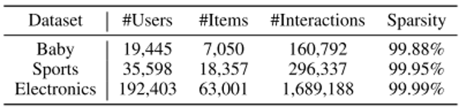
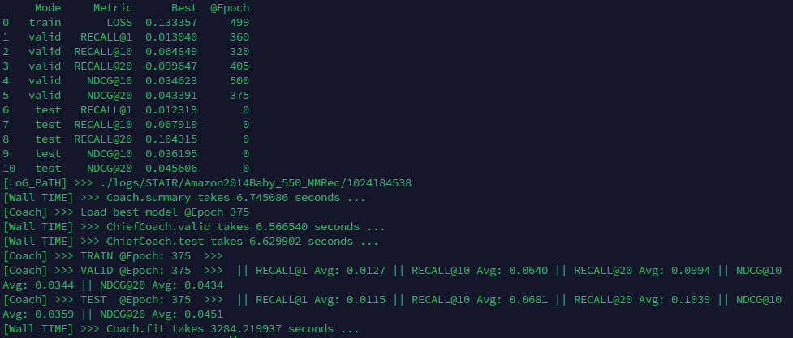
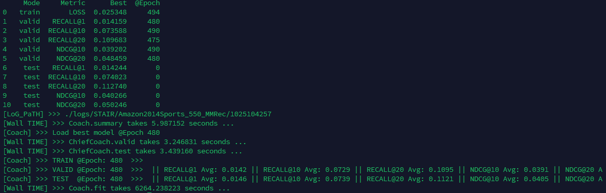
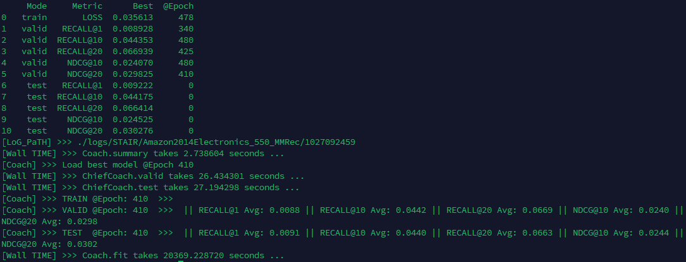
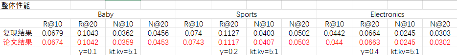

# STAIR

STAIR模型的PyTorch实现："STAIR: 电子商务推荐中协同与多模态信息的协同操控" ([arXiv](http://arxiv.org/abs/2412.11729))

 

## 环境配置

**要求:** Python >= 3.9 | [PyTorch >=2.0](https://pytorch.org/) | [TorchData >=0.6.0](https://github.com/pytorch/data) | [PyG >=2.3](https://pytorch-geometric.readthedocs.io/en/latest/notes/installation.html#)

    conda create -n stair python=3.9;conda activate stair;bash env.sh

## 数据集

本项目中使用的所有数据集均可通过 [Google Drive](https://drive.google.com/drive/folders/1fs_UqERiRkATh_P06NoxNvf1i_j8MOHk?usp=sharing) 访问获取。

## 使用方法
  
    cd STAIR
    python main.py --config configs/Amazon2014Baby_550_MMRec.yaml

## 复现结果

### 数据集介绍

#### Baby数据集

**数据集背景**

该数据集是由 Julian McAuley 等人在加州大学圣迭戈分校（UCSD）发布的“Amazon 商品评论与元数据”大型公开数据集的一个子集之一。

此数据集中涵盖了从 1996 年 5 月至 2014 年 7 月期间，Amazon 上用户对各类别商品（包括 Baby 类别）所做的评论，包括评分、文本、帮助投票，以及商品本身的元数据（如标题、类别、价格、品牌、相关购买关系等）｡

在类别划分表中，“Baby”类别被列为一个单独类别，其 5-core（即每个用户和商品至少 5 次评论）子集在 2014 年版中有 “Baby 5-core: 160,792 reviews only (915,446 ratings)” 这一说明。

因此，“Baby 数据集”一般指的是从这一整体 Amazon 评论数据中筛出“Baby（婴幼儿用品）”类别部分的评论／商品数据，适合用于推荐系统、情感分析、商品属性挖掘等研究。

**实验设置**

用户–商品交互数据：从<code>ratings_only</code>中提取<code>(userID, itemID, timestamp)</code>，构建用户–物品二分图。

文本模态特征（textual_modality.pkl）、视觉模态特征（visual_modality.pkl）。

<pre>root: data
dataset: Amazon2014Baby_550_MMRec

embedding_dim: 64
num_layers: 3

epochs: 500
batch_size: 1024
optimizer: adamwsevo
lr: 1.e-3
weight_decay: 0.3

gamma: 0.1
mfiles: textual_modality.pkl,visual_modality.pkl
num_neighbors: '5-1'

monitors: [LOSS, Recall@1, Recall@10, Recall@20, NDCG@10, NDCG@20]
which4best: NDCG@20</pre>

**运行结果**

#### Sports数据集

**数据集背景**

这个数据集是 Julian McAuley 及其团队发布的 Amazon Review Data (2014) 的一个类别子集。该总体数据集涵盖多个 Amazon 商品类别，从 1996 年至 2014 年期间用户的评论 +商品元数据。

在类别划分中，“Sports & Outdoors”／“Sports and Outdoors” 是其中一个类别，其 5-core（即用户和物品至少有 5 条评论）版在原文档中列出。

这意味着该子集选取了所有在 “Sports & Outdoors” 类别里：用户–商品交互（评论/评分）数据 + 相应商品在该类别下的元数据。

**实验设置**

用户–商品交互数据：从<code>ratings_only</code>中提取<code>(userID, itemID, timestamp)</code>，构建用户–物品二分图。

文本模态特征（textual_modality.pkl）、视觉模态特征（visual_modality.pkl）。

<pre>root: data
dataset: Amazon2014Sports_550_MMRec

embedding_dim: 64
num_layers: 3

epochs: 500
batch_size: 1024
optimizer: adamwsevo
lr: 1.e-3
weight_decay: 0.1

gamma: 0.2
mfiles: textual_modality.pkl,visual_modality.pkl
num_neighbors: '5-1'

monitors: [LOSS, Recall@1, Recall@10, Recall@20, NDCG@10, NDCG@20]
which4best: NDCG@20</pre>

**运行结果**

#### Electroonics数据集

**数据集背景**

这个数据集是由 Julian McAuley 等人在加州大学圣地亚哥分校（UCSD）发布的 “Amazon 商品评论与元数据”大型公开数据集的一个类别子集之一。

在其 “Electronics”（电子产品）类别中，收录了 Amazon 上用户对电子产品的评论（包括评分、文本、帮助投票）和这些产品的元数据（如标题、类别、品牌、价格、图片链接）。

**实验设置**

用户–商品交互数据：从<code>ratings_only</code>中提取<code>(userID, itemID, timestamp)</code>，构建用户–物品二分图。

文本模态特征（textual_modality.pkl）、视觉模态特征（visual_modality.pkl）。

<pre>root: data
dataset: Amazon2014Electronics_550_MMRec

embedding_dim: 64
num_layers: 3

epochs: 500
batch_size: 4096
optimizer: adamwsevo
lr: 1.e-3
weight_decay: 0.1

gamma: 0.4
mfiles: textual_modality.pkl,visual_modality.pkl
num_neighbors: '5-1'

monitors: [LOSS, Recall@1, Recall@10, Recall@20, NDCG@10, NDCG@20]
which4best: NDCG@20</pre>

**运行结果**

### 与论文结果对比

