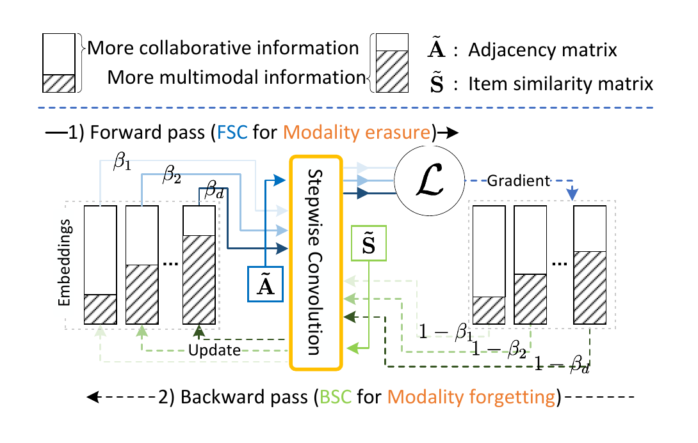

# STAIR

PyTorch implementation of "STAIR: Manipulating Collaborative and Multimodal Information for E-Commerce Recommendation". ([arXiv](http://arxiv.org/abs/2412.11729))

 

## Environment Setup

**Requirements:** Python >= 3.9 | [PyTorch >=2.0](https://pytorch.org/) | [TorchData >=0.6.0](https://github.com/pytorch/data) | [PyG >=2.3](https://pytorch-geometric.readthedocs.io/en/latest/notes/installation.html#)

    conda create -n stair python=3.9;conda activate stair;bash env.sh

## Datasets

All datasets used in this project can be accessed via [Google Drive](https://drive.google.com/drive/folders/1fs_UqERiRkATh_P06NoxNvf1i_j8MOHk?usp=sharing).

## Usage
  
    cd STAIR
    python main.py --config configs/Amazon2014Baby_550_MMRec.yaml

## Citation

If you find STAIR useful in your research, please kindly cite:

    @article{xu2024stair,
        title={STAIR: Manipulating Collaborative and Multimodal Information for E-Commerce Recommendation},
        author={Xu, Cong and He, Yunhang and Wang, Jun and Zhang, Wei},
        journal={arXiv preprint arXiv:2412.11729},
        year={2024}
    }